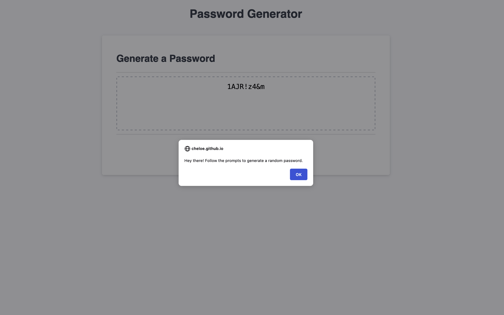

# JavaScript-Password-Generator
A password generator with user-defined length and character-type parameters

## What I did: 

1. Created repo and readme
2. Created arrays for each password criteria
3. Created function to capture password length via window prompts
4. Created functions to let user tell me Y/N if they want each PW criteria, and for each criteria selected changes the corresponding value in the object promptValues to "True"
5. Created methods for the promptValues object that check for T/F for each criteria and for every true found add the corresponding array to a superarray.
6. Added a random number generator
7. Created a function that uses random numbers to pick out positions in the superarray and write the corresponding characters to the variable 'password'
8. Added error state for when user doesn't choose any password parameters.
9. I couldn't figure out how to make a random password that still included one of each character type selected, but I left my attempts in at the end of my code and just commented them out. 

## Link to live site:

https://cheloe.github.io/JavaScript-Password-Generator/

## Link to GitHub repository

https://github.com/Cheloe/JavaScript-Password-Generator

## Screenshot of live site

